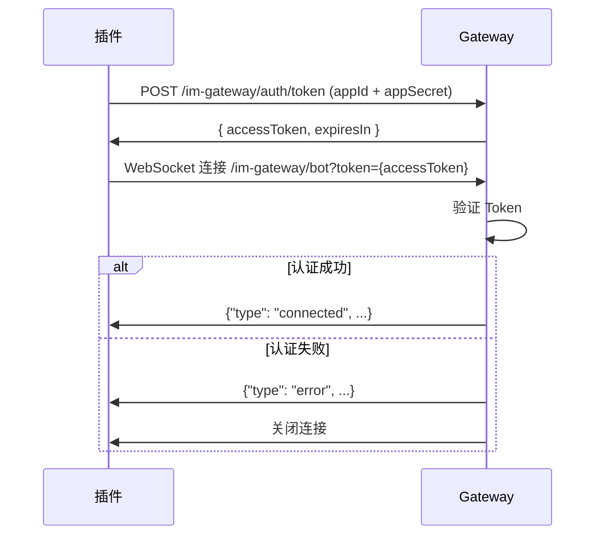

# ShareCRM IM Gateway - 插件侧接口文档

> 本文档用于 OpenClaw 插件对接 ShareCRM

## 概述

- **通信架构**: WebSocket 下行 + REST API 上行
- **鉴权方式**: 基于 appId/appSecret 获取 accessToken
- **外部接口前缀**: `/im-gateway` （暴露公网）

### 架构说明

```
┌─────────────┐                      ┌─────────────┐
│  OpenClaw   │◄──── WebSocket ──────│   Gateway   │
│   Plugin    │      (下行推送)        │   Server    │
│             │                      │             │
│             │───── REST API ──────►│             │
│             │      (上行请求)        │             │
└─────────────┘                      └─────────────┘
```

| 通道 | 协议 | 方向 | 用途 |
|------|------|------|------|
| 下行 | WebSocket | Gateway → OpenClaw | 推送用户消息、系统事件 |
| 上行 | REST API | OpenClaw → Gateway | 发送消息给企信用户 |

---

## 1. 鉴权

### 1.1 获取 AccessToken

通过 appId 和 appSecret 获取 accessToken，用于后续 WebSocket 连接和 REST API 调用。

**请求:**

```
POST /im-gateway/auth/token
Content-Type: application/json

{
  "appId": "bot-001",
  "appSecret": "secret123"
}
```

**成功响应:**

```json
{
  "code": 0,
  "data": {
    "accessToken": "eyJhbGciOiJIUzI1NiIsInR5cCI6IkpXVCJ9...",
    "expiresIn": 7200,
    "tokenType": "Bearer"
  }
}
```

**失败响应:**

```json
{
  "code": 40001,
  "message": "appId 或 appSecret 错误"
}
```

| 字段 | 类型 | 说明 |
|------|------|------|
| code | number | 状态码，0 表示成功 |
| data.accessToken | string | 访问令牌 |
| data.expiresIn | number | 有效期（秒），默认 7200 秒 |
| data.tokenType | string | 固定值 `"Bearer"` |

### 1.2 Token 使用方式

- **WebSocket**: 连接时作为查询参数 `?token={accessToken}`
- **REST API**: 请求头 `Authorization: Bearer {accessToken}`

### 1.3 Token 有效期与刷新

- Token 有效期为 2 小时（7200 秒）
- 建议在 Token 过期前 5 分钟主动刷新
- Token 过期后需重新调用 `/im-gateway/auth/token` 获取新 Token

---

## 2. WebSocket 下行通道

### 2.1 连接端点

```
ws://{host}:{port}/im-gateway/bot?token={accessToken}
```

**参数说明:**

| 参数 | 类型 | 说明 |
|------|------|------|
| host | string | Gateway 服务地址 |
| port | number | 服务端口，默认 8099 |
| token | string | 通过 API 获取的 accessToken |

**示例:**

```
accessToken = "eyJhbGciOiJIUzI1NiIsInR5cCI6IkpXVCJ9..."

连接地址: ws://localhost:8099/im-gateway/bot?token=eyJhbGciOiJIUzI1NiIsInR5cCI6IkpXVCJ9...
```

### 2.2 连接流程



### 2.3 下行消息协议

所有消息均为 JSON 格式，从 Gateway 推送到 OpenClaw。

#### 2.3.1 connected (连接成功)

连接并认证成功后，服务端发送此消息。

```json
{
  "type": "connected",
  "data": {
    "bot_id": "bot-001"
  }
}
```

| 字段 | 类型 | 说明 |
|------|------|------|
| type | string | 固定值 `"connected"` |
| data.bot_id | string | Bot 的 appId |

#### 2.3.2 message (收到用户消息)

当有用户发送消息给 Bot 时，服务端推送此消息。

```json
{
  "type": "message",
  "data": {
    "message_id": "msg-abc12345",
    "chat_id": "ch-001",
    "chat_type": "direct",
    "from": {
      "id": "u-1001",
      "name": "张三"
    },
    "text": "你好",
    "date": 1735689600
  }
}
```

| 字段 | 类型 | 说明 |
|------|------|------|
| type | string | 固定值 `"message"` |
| data.message_id | string | 消息唯一 ID |
| data.chat_id | string | 会话 ID |
| data.chat_type | string | 会话类型: `"direct"` (私聊) 或 `"group"` (群聊) |
| data.from.id | string | 发送者用户 ID |
| data.from.name | string | 发送者名称 |
| data.text | string | 消息文本内容 |
| data.date | number | Unix 时间戳（秒） |

#### 2.3.3 error (错误)

发生错误时推送。

```json
{
  "type": "error",
  "error": {
    "code": "AUTH_FAILED",
    "message": "Token 无效或已过期"
  }
}
```

| 字段 | 类型 | 说明 |
|------|------|------|
| type | string | 固定值 `"error"` |
| error.code | string | 错误代码 |
| error.message | string | 错误描述 |

**错误代码列表:**

| 错误代码 | 说明 |
|----------|------|
| AUTH_FAILED | 认证失败（Token 无效或账号禁用） |
| TOKEN_EXPIRED | Token 已过期 |
| ACCOUNT_DISABLED | 账号已禁用 |

### 2.4 心跳机制

使用 WebSocket 原生 Ping/Pong 机制，无需发送自定义心跳消息。

---

## 3. REST API 上行通道

### 3.1 发送消息给企信用户

插件主动发送消息给企信用户。

**请求:**

```
POST /im-gateway/qixin/message/send
Authorization: Bearer {accessToken}
Content-Type: application/json

{
  "chat_id": "0:fs:session123:",
  "text": "你好，我是机器人"
}
```

**chat_id 格式说明:**

chat_id 采用企信会话编码格式: `{env}:{ea}:{sessionId}:{parentSessionId}`

| 字段 | 说明 |
|------|------|
| env | 是否互联: 0=企业内, 1=互联 |
| ea | 会话所属企业 EA |
| sessionId | 企信会话 ID |
| parentSessionId | 父会话 ID（可为空） |

**也可以使用分离字段:**

```json
{
  "env": 0,
  "ea": "fs",
  "session_id": "session123",
  "parent_session_id": "",
  "text": "你好，我是机器人"
}
```

**成功响应:**

```json
{
  "code": 0,
  "data": {
    "message_id": "msg-123456"
  }
}
```

**失败响应:**

```json
{
  "code": 40002,
  "message": "chat_id 不能为空"
}
```

| 字段 | 类型 | 必填 | 说明 |
|------|------|------|------|
| chat_id | string | 是* | 目标会话 ID（编码格式） |
| text | string | 是 | 消息文本内容 |
| env | number | 否 | 是否互联 (与 chat_id 二选一) |
| ea | string | 否 | 企业 EA |
| session_id | string | 否 | 会话 ID |
| parent_session_id | string | 否 | 父会话 ID |

### 3.2 API 错误码

| 错误码 | 说明 |
|--------|------|
| 0 | 成功 |
| 40001 | 认证失败（appId 或 appSecret 错误） |
| 40002 | 参数错误（chat_id 或 text 为空） |
| 40003 | Token 无效或已过期 |
| 40004 | 账号已禁用 |
| 50001 | 服务器内部错误 |

---

## 4. TypeScript 类型定义

```typescript
// ============ 鉴权相关 ============

/** 获取 Token 请求 */
interface AuthTokenRequest {
  appId: string;
  appSecret: string;
}

/** 获取 Token 响应 */
interface AuthTokenResponse {
  code: number;
  data?: {
    accessToken: string;
    expiresIn: number;
    tokenType: "Bearer";
  };
  message?: string;
}

// ============ WebSocket 下行消息类型 ============

/** 连接成功消息 */
interface ConnectedMessage {
  type: "connected";
  data: {
    bot_id: string;
  };
}

/** 用户消息事件 */
interface MessageEvent {
  type: "message";
  data: {
    message_id: string;
    chat_id: string;        // 格式: env:ea:sessionId:parentSessionId
    chat_type: "direct" | "group";
    from: {
      id: string;
      name: string;
    };
    text: string;
    date: number;  // Unix timestamp (seconds)
  };
}

/** 错误消息 */
interface ErrorMessage {
  type: "error";
  error: {
    code: string;
    message: string;
  };
}

/** 服务端下行消息联合类型 */
type ServerMessage = ConnectedMessage | MessageEvent | ErrorMessage;

// ============ REST API 类型 ============

/** 发送消息请求 */
interface SendMessageRequest {
  chat_id?: string;          // 编码格式: env:ea:sessionId:parentSessionId
  text: string;
  // 可选：分离字段（与 chat_id 二选一）
  env?: number;
  ea?: string;
  session_id?: string;
  parent_session_id?: string;
  reply_message_id?: number;
}

/** 发送消息响应 */
interface SendMessageResponse {
  code: number;
  data?: {
    message_id: string;
  };
  message?: string;
}

/** API 通用响应 */
interface ApiResponse<T = unknown> {
  code: number;
  data?: T;
  message?: string;
}
```

---

## 5. 完整示例代码

```typescript
import WebSocket from "ws";

interface ClientOptions {
  gatewayUrl: string;  // 例: "ws://localhost:8099"
  apiBaseUrl: string;  // 例: "http://localhost:8099"
  appId: string;
  appSecret: string;
  onMessage: (event: MessageEvent["data"]) => void;
  onConnected: (info: ConnectedMessage["data"]) => void;
  onDisconnected: (reason: string) => void;
  onError?: (error: Error) => void;
}

class ShareCrmClient {
  private ws: WebSocket | null = null;
  private accessToken: string | null = null;
  private tokenExpiresAt: number = 0;

  constructor(private options: ClientOptions) {}

  /** 获取 AccessToken */
  private async fetchAccessToken(): Promise<string> {
    const response = await fetch(`${this.options.apiBaseUrl}/im-gateway/auth/token`, {
      method: "POST",
      headers: { "Content-Type": "application/json" },
      body: JSON.stringify({
        appId: this.options.appId,
        appSecret: this.options.appSecret,
      }),
    });

    const data: AuthTokenResponse = await response.json();
    
    if (data.code !== 0 || !data.data) {
      throw new Error(data.message || "获取 Token 失败");
    }

    this.accessToken = data.data.accessToken;
    // 提前 5 分钟刷新
    this.tokenExpiresAt = Date.now() + (data.data.expiresIn - 300) * 1000;
    
    return this.accessToken;
  }

  /** 确保 Token 有效 */
  private async ensureToken(): Promise<string> {
    if (this.accessToken && Date.now() < this.tokenExpiresAt) {
      return this.accessToken;
    }
    return this.fetchAccessToken();
  }

  /** 连接 Gateway */
  async connect(): Promise<void> {
    const token = await this.ensureToken();
    const url = `${this.options.gatewayUrl}/im-gateway/bot?token=${token}`;
    
    this.ws = new WebSocket(url);

    this.ws.on("open", () => {
      console.log("WebSocket 连接已建立");
    });

    this.ws.on("message", (data) => {
      const msg: ServerMessage = JSON.parse(data.toString());
      this.handleMessage(msg);
    });

    this.ws.on("close", (code, reason) => {
      this.options.onDisconnected(reason?.toString() || `code: ${code}`);
    });

    this.ws.on("error", (error) => {
      this.options.onError?.(error);
    });
  }

  /** 处理服务端消息 */
  private handleMessage(msg: ServerMessage): void {
    switch (msg.type) {
      case "connected":
        this.options.onConnected(msg.data);
        break;

      case "message":
        this.options.onMessage(msg.data);
        break;

      case "error":
        console.error(`错误 [${msg.error.code}]: ${msg.error.message}`);
        this.options.onError?.(new Error(msg.error.message));
        break;
    }
  }

  /** 发送消息给企信用户 (通过 REST API) */
  async sendMessage(chatId: string, text: string): Promise<{
    ok: boolean;
    messageId?: string;
  }> {
    try {
      const token = await this.ensureToken();
      
      const response = await fetch(`${this.options.apiBaseUrl}/im-gateway/qixin/message/send`, {
        method: "POST",
        headers: {
          "Content-Type": "application/json",
          "Authorization": `Bearer ${token}`,
        },
        body: JSON.stringify({
          chat_id: chatId,
          text,
        }),
      });

      const data: SendMessageResponse = await response.json();
      
      if (data.code === 0 && data.data) {
        return { ok: true, messageId: data.data.message_id };
      }
      
      return { ok: false };
    } catch (error) {
      console.error("发送消息失败:", error);
      return { ok: false };
    }
  }

  /** 断开连接 */
  disconnect(): void {
    this.ws?.close();
    this.ws = null;
  }
}

// ============ 使用示例 ============

const client = new ShareCrmClient({
  gatewayUrl: "ws://localhost:8099",
  apiBaseUrl: "http://localhost:8099",
  appId: "bot-001",
  appSecret: "your-secret",

  onConnected: (info) => {
    console.log(`已连接: bot_id=${info.bot_id}`);
  },

  onMessage: async (event) => {
    console.log(`收到消息: ${event.from.name}: ${event.text}`);
    
    // 通过 REST API 回复消息
    const result = await client.sendMessage(event.chat_id, `收到: ${event.text}`);
    console.log(`回复结果: ${result.ok}`);
  },

  onDisconnected: (reason) => {
    console.log(`连接断开: ${reason}`);
    // 可选：自动重连
    setTimeout(() => client.connect(), 3000);
  },
});

client.connect();
```

---

## 6. 配置说明

插件配置示例 (openclaw.yaml):

```yaml
channels:
  sharecrm:
    gatewayUrl: "ws://localhost:8099"
    apiBaseUrl: "http://localhost:8099"
    appId: "bot-001"
    appSecret: "your-secret"
    dmPolicy: "open"  # open | pairing | allowlist | disabled
    allowFrom: ["*"]     # dmPolicy=allowlist 时的白名单
```

| 配置项 | 类型 | 必填 | 说明 |
|--------|------|------|------|
| gatewayUrl | string | 是 | Gateway WebSocket 地址 |
| apiBaseUrl | string | 是 | Gateway REST API 地址 |
| appId | string | 是 | 应用 ID |
| appSecret | string | 是 | 应用密钥 |
| dmPolicy | string | 否 | 私聊策略，默认 `open` |
| allowFrom | string[] | 否 | 白名单用户 ID 列表 |

---

## 7. 错误处理建议

1. **Token 过期**: 在 Token 过期前 5 分钟主动刷新，或捕获 40003 错误后重新获取
2. **连接失败**: 检查 Gateway 服务是否运行、Token 是否正确
3. **认证失败**: 检查 appId/appSecret 是否匹配、账号是否启用
4. **发送失败**: 检查 chat_id 是否有效、网络是否正常
5. **断线重连**: 建议在 `onDisconnected` 中实现 3 秒延迟重连

---

## 8. 版本记录

| 版本 | 日期 | 变更内容 |
|------|------|----------|
| 1.0.0 | 2026-03-02 | 初始版本 |
| 2.0.0 | 2026-03-03 | 重构为 WebSocket 下行 + REST API 上行架构，新增 AccessToken 鉴权机制 |
| 2.1.0 | 2026-03-03 | 简化接口路径，移除 bot_name，chat_id 采用企信会话编码格式 |
