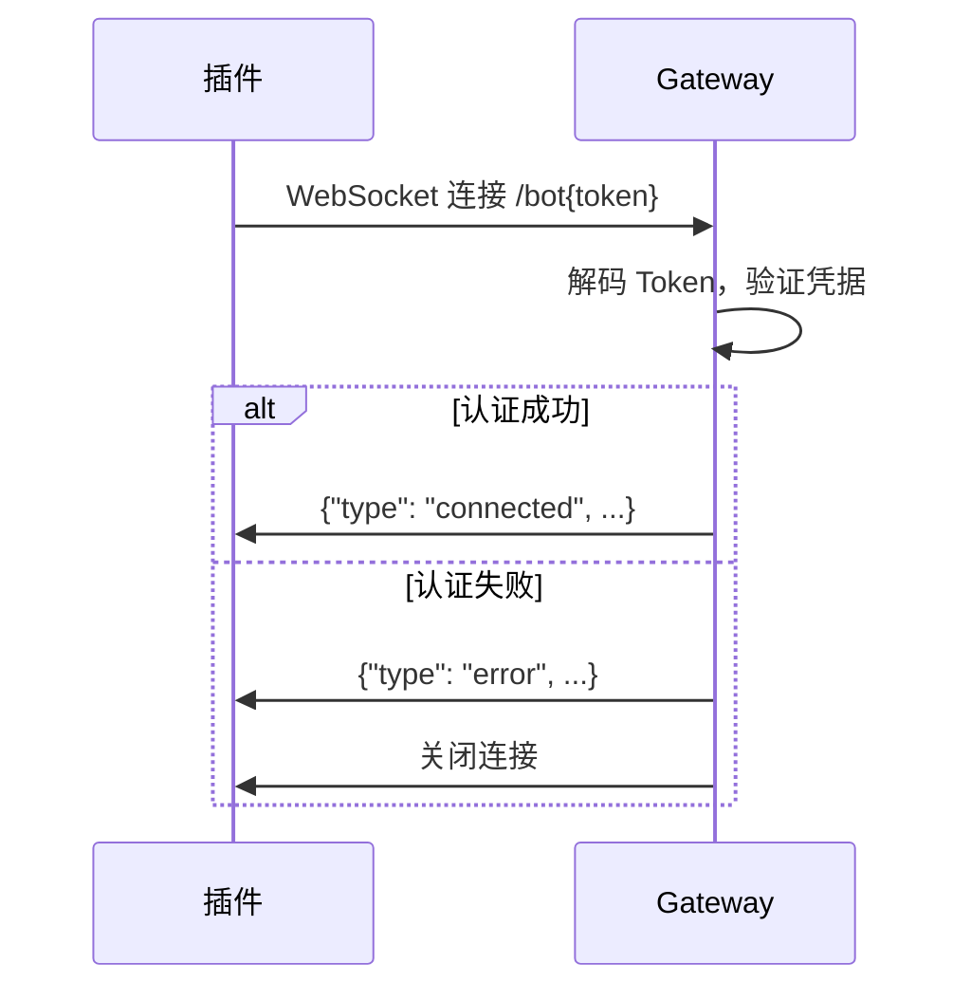

# ShareCRM IM Gateway - 插件侧接口文档

> 本文档用于 OpenClaw 插件对接 sharecrm-im-gateway

## 概述

- **Gateway 服务默认端口**: `8099`
- **协议**: WebSocket (ws:// 或 wss://)
- **认证方式**: URL Token (Base64 编码)

---

## 1. WebSocket 连接

### 1.1 连接端点

```
ws://{host}:{port}/bot{token}
```

**参数说明:**
| 参数 | 类型 | 说明 |
|------|------|------|
| host | string | Gateway 服务地址 |
| port | number | 服务端口，默认 8099 |
| token | string | Base64 编码的认证凭据 |

### 1.2 Token 生成

Token 格式为 Base64 编码的 `appId:appSecret`：

```typescript
const token = btoa(`${appId}:${appSecret}`);
// 或 Node.js
const token = Buffer.from(`${appId}:${appSecret}`).toString('base64');
```

**示例:**
```
appId = "bot-001"
appSecret = "secret123"
token = Base64("bot-001:secret123") = "Ym90LTAwMTpzZWNyZXQxMjM="

连接地址: ws://localhost:8099/botYm90LTAwMTpzZWNyZXQxMjM=
```

### 1.3 连接流程



---

## 2. 消息协议

所有消息均为 JSON 格式。

### 2.1 服务端 → 插件 消息

#### 2.1.1 connected (连接成功)

连接并认证成功后，服务端发送此消息。

```json
{
  "type": "connected",
  "data": {
    "bot_id": "bot-001",
    "bot_name": "测试机器人"
  }
}
```

| 字段 | 类型 | 说明 |
|------|------|------|
| type | string | 固定值 `"connected"` |
| data.bot_id | string | Bot 的 appId |
| data.bot_name | string | Bot 名称 |

#### 2.1.2 message (收到用户消息)

当有用户发送消息给 Bot 时，服务端推送此消息。

```json
{
  "type": "message",
  "data": {
    "message_id": "msg-abc12345",
    "chat_id": "ch-001",
    "chat_type": "direct",
    "from": {
      "id": "u-1001",
      "name": "张三"
    },
    "text": "你好",
    "date": 1735689600
  }
}
```

| 字段 | 类型 | 说明 |
|------|------|------|
| type | string | 固定值 `"message"` |
| data.message_id | string | 消息唯一 ID |
| data.chat_id | string | 会话 ID |
| data.chat_type | string | 会话类型: `"direct"` (私聊) 或 `"group"` (群聊) |
| data.from.id | string | 发送者用户 ID |
| data.from.name | string | 发送者名称 |
| data.text | string | 消息文本内容 |
| data.date | number | Unix 时间戳（秒） |

#### 2.1.3 send_result (发送结果)

插件发送消息后，服务端返回发送结果。

**成功:**
```json
{
  "type": "send_result",
  "id": "req-xxx",
  "ok": true,
  "data": {
    "message_id": "msg-123456"
  }
}
```

**失败:**
```json
{
  "type": "send_result",
  "id": "req-xxx",
  "ok": false,
  "data": null
}
```

| 字段 | 类型 | 说明 |
|------|------|------|
| type | string | 固定值 `"send_result"` |
| id | string | 请求 ID，与发送请求的 id 对应 |
| ok | boolean | 是否成功 |
| data.message_id | string | 成功时返回消息 ID |

#### 2.1.4 error (错误)

发生错误时推送。

```json
{
  "type": "error",
  "id": "req-xxx",
  "error": {
    "code": "INVALID_CHAT_ID",
    "message": "chat_id 不能为空"
  }
}
```

| 字段 | 类型 | 说明 |
|------|------|------|
| type | string | 固定值 `"error"` |
| id | string | 请求 ID（如果有关联请求） |
| error.code | string | 错误代码 |
| error.message | string | 错误描述 |

**错误代码列表:**

| 错误代码 | 说明 |
|----------|------|
| AUTH_FAILED | 认证失败（Token 无效或账号禁用） |
| UNKNOWN_TYPE | 未知的消息类型 |
| INVALID_DATA | data 字段为空或格式错误 |
| INVALID_CHAT_ID | chat_id 为空 |
| INVALID_TEXT | text 为空 |

---

### 2.2 插件 → 服务端 消息

#### 2.2.1 send (发送消息)

插件主动发送消息给用户。

```json
{
  "type": "send",
  "id": "req-1234567890-abc123",
  "data": {
    "chat_id": "ch-001",
    "text": "你好，我是机器人"
  }
}
```

| 字段 | 类型 | 必填 | 说明 |
|------|------|------|------|
| type | string | 是 | 固定值 `"send"` |
| id | string | 是 | 请求唯一 ID，用于匹配响应 |
| data.chat_id | string | 是 | 目标会话 ID |
| data.text | string | 是 | 消息文本内容 |

**请求 ID 建议格式:**
```typescript
const id = `req-${Date.now()}-${Math.random().toString(36).slice(2, 8)}`;
```

---

## 3. 心跳机制

使用 WebSocket 原生 Ping/Pong 机制，无需发送自定义心跳消息。

---

## 4. TypeScript 类型定义

```typescript
// ============ 服务端消息类型 ============

/** 连接成功消息 */
interface ConnectedMessage {
  type: "connected";
  data: {
    bot_id: string;
    bot_name: string;
  };
}

/** 用户消息事件 */
interface MessageEvent {
  type: "message";
  data: {
    message_id: string;
    chat_id: string;
    chat_type: "direct" | "group";
    from: {
      id: string;
      name: string;
    };
    text: string;
    date: number;  // Unix timestamp (seconds)
  };
}

/** 发送结果 */
interface SendResultMessage {
  type: "send_result";
  id: string;
  ok: boolean;
  data?: {
    message_id: string;
  };
}

/** 错误消息 */
interface ErrorMessage {
  type: "error";
  id?: string;
  error: {
    code: string;
    message: string;
  };
}

/** 服务端消息联合类型 */
type ServerMessage = ConnectedMessage | MessageEvent | SendResultMessage | ErrorMessage;

// ============ 客户端消息类型 ============

/** 发送消息请求 */
interface SendRequest {
  type: "send";
  id: string;
  data: {
    chat_id: string;
    text: string;
  };
}

/** 客户端消息联合类型 */
type ClientMessage = SendRequest;
```

---

## 5. 完整示例代码

```typescript
import WebSocket from "ws";

interface ClientOptions {
  gatewayUrl: string;  // 例: "ws://localhost:8099"
  appId: string;
  appSecret: string;
  onMessage: (event: MessageEvent["data"]) => void;
  onConnected: (info: ConnectedMessage["data"]) => void;
  onDisconnected: (reason: string) => void;
  onError?: (error: Error) => void;
}

class ShareCrmClient {
  private ws: WebSocket | null = null;
  private pendingRequests = new Map<string, {
    resolve: (ok: boolean, messageId?: string) => void;
    timeout: NodeJS.Timeout;
  }>();

  constructor(private options: ClientOptions) {}

  /** 连接 Gateway */
  connect(): void {
    const token = Buffer.from(
      `${this.options.appId}:${this.options.appSecret}`
    ).toString("base64");

    const url = `${this.options.gatewayUrl}/bot${token}`;
    
    this.ws = new WebSocket(url);

    this.ws.on("open", () => {
      console.log("WebSocket 连接已建立");
    });

    this.ws.on("message", (data) => {
      const msg = JSON.parse(data.toString());
      this.handleMessage(msg);
    });

    this.ws.on("close", (code, reason) => {
      this.options.onDisconnected(reason?.toString() || `code: ${code}`);
    });

    this.ws.on("error", (error) => {
      this.options.onError?.(error);
    });
  }

  /** 处理服务端消息 */
  private handleMessage(msg: ServerMessage): void {
    switch (msg.type) {
      case "connected":
        this.options.onConnected(msg.data);
        break;

      case "message":
        this.options.onMessage(msg.data);
        break;

      case "send_result": {
        const pending = this.pendingRequests.get(msg.id);
        if (pending) {
          clearTimeout(pending.timeout);
          this.pendingRequests.delete(msg.id);
          pending.resolve(msg.ok, msg.data?.message_id);
        }
        break;
      }

      case "error": {
        if (msg.id) {
          const pending = this.pendingRequests.get(msg.id);
          if (pending) {
            clearTimeout(pending.timeout);
            this.pendingRequests.delete(msg.id);
            pending.resolve(false);
          }
        }
        console.error(`错误 [${msg.error.code}]: ${msg.error.message}`);
        break;
      }
    }
  }

  /** 发送消息 */
  async sendMessage(chatId: string, text: string): Promise<{
    ok: boolean;
    messageId?: string;
  }> {
    if (!this.ws || this.ws.readyState !== WebSocket.OPEN) {
      return { ok: false };
    }

    const id = `req-${Date.now()}-${Math.random().toString(36).slice(2, 8)}`;

    return new Promise((resolve) => {
      const timeout = setTimeout(() => {
        this.pendingRequests.delete(id);
        resolve({ ok: false });
      }, 10000);

      this.pendingRequests.set(id, {
        resolve: (ok, messageId) => resolve({ ok, messageId }),
        timeout,
      });

      this.ws!.send(JSON.stringify({
        type: "send",
        id,
        data: { chat_id: chatId, text },
      }));
    });
  }

  /** 断开连接 */
  disconnect(): void {
    this.ws?.close();
    this.ws = null;
  }
}

// ============ 使用示例 ============

const client = new ShareCrmClient({
  gatewayUrl: "ws://localhost:8099",
  appId: "bot-001",
  appSecret: "your-secret",

  onConnected: (info) => {
    console.log(`已连接: ${info.bot_name}`);
  },

  onMessage: async (event) => {
    console.log(`收到消息: ${event.from.name}: ${event.text}`);
    
    // 回复消息
    const result = await client.sendMessage(event.chat_id, `收到: ${event.text}`);
    console.log(`回复结果: ${result.ok}`);
  },

  onDisconnected: (reason) => {
    console.log(`连接断开: ${reason}`);
    // 可选：自动重连
    setTimeout(() => client.connect(), 3000);
  },
});

client.connect();
```

---

## 6. 配置说明

插件配置示例 (openclaw.yaml):

```yaml
channels:
  sharecrm:
    gatewayUrl: "ws://localhost:8099"
    botToken: "Ym90LTAwMTpzZWNyZXQxMjM="  # Base64(appId:appSecret)
    dmPolicy: "open"  # open | pairing | allowlist | disabled
    allowFrom: []     # dmPolicy=allowlist 时的白名单
```

| 配置项 | 类型 | 必填 | 说明 |
|--------|------|------|------|
| gatewayUrl | string | 是 | Gateway WebSocket 地址 |
| botToken | string | 是 | Base64 编码的认证凭据 |
| dmPolicy | string | 否 | 私聊策略，默认 `open` |
| allowFrom | string[] | 否 | 白名单用户 ID 列表 |
| chatId | string | 否 | 固定回复的会话 ID |

---

## 7. 错误处理建议

1. **连接失败**: 检查 Gateway 服务是否运行、Token 是否正确
2. **认证失败**: 检查 appId/appSecret 是否匹配、账号是否启用
3. **发送超时**: 建议设置 10 秒超时，超时后重试或提示用户
4. **断线重连**: 建议在 `onDisconnected` 中实现 3 秒延迟重连

---

## 8. 版本记录

| 版本 | 日期 | 变更内容 |
|------|------|----------|
| 1.0.0 | 2026-03-02 | 初始版本 |
